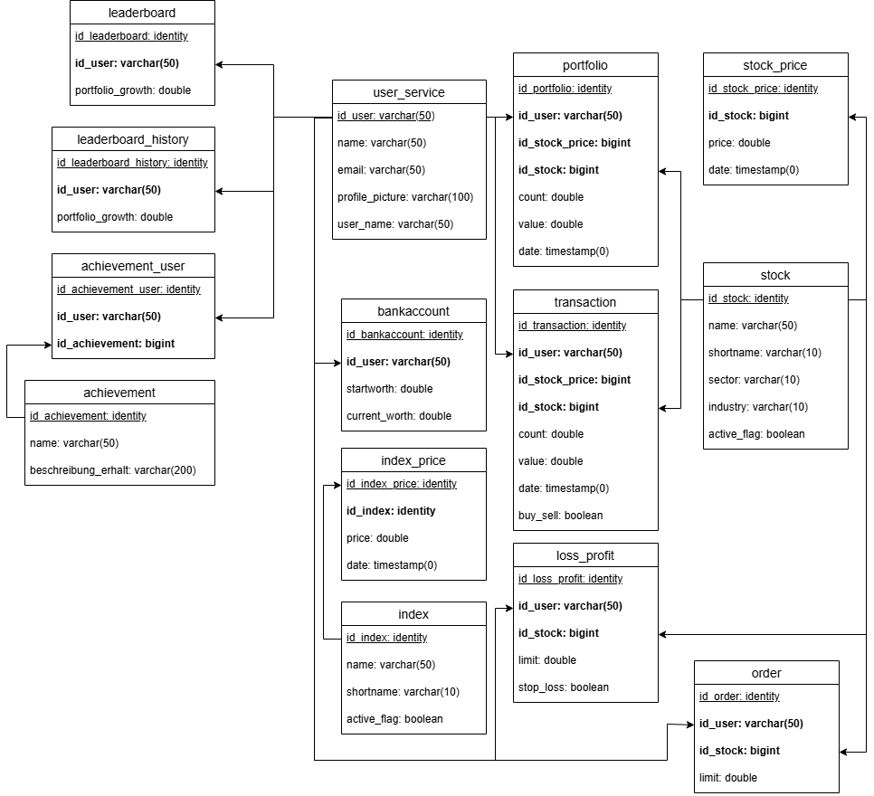

# Datenbankmodell <!-- omit in toc -->

|                        |                 |
| :--------------------- | --------------- |
| Projektname:           | SWIFT           |
| Letzte Aktualisierung: | 09.10.2025      |

## Inhaltsverzeichnis <!-- omit in toc -->

- [ER-Diagramm](#er-diagramm)
- [Datenbankskript](#skripte)
- [DB-Server](#db-server-konfigurationsparameter)

## ER-Diagramm



## Skripte 
Beachten Sie das die Skripte für eine PostgreSQL Datenbank ausgelegt sind!<br>
```SQL
    DROP TABLE IF EXISTS public.stock CASCADE;
    CREATE TABLE IF NOT EXISTS public.stock
    (
        id_stock bigint NOT NULL GENERATED ALWAYS AS IDENTITY ( INCREMENT 1 START 1 MINVALUE 1 MAXVALUE 9223372036854775807 CACHE 1 ),
        name varchar(50) NOT NULL,
        shortname varchar(10) NOT NULL,
        sector varchar(50) DEFAULT NULL,
        industry varchar(50) DEFAULT NULL,
        active_flag boolean NOT NULL DEFAULT 0,
        CONSTRAINT stock_pkey PRIMARY KEY (id_stock)
    );

    DROP TABLE IF EXISTS public.user_service CASCADE;
    CREATE TABLE IF NOT EXISTS public.user_service
    (
        id_user varchar(50) NOT NULL,
        name varchar(50) NOT NULL,
        email varchar(50) NOT NULL,
        profile_picture varchar(100) NOT NULL,
        user_name varchar(50) NOT NULL,
        CONSTRAINT user_service_pkey PRIMARY KEY (id_user)
    );

    DROP TABLE IF EXISTS public.stock_price CASCADE;
    CREATE TABLE IF NOT EXISTS public.stock_price
    (
        id_stock_price bigint NOT NULL GENERATED ALWAYS AS IDENTITY ( INCREMENT 1 START 1 MINVALUE 1 MAXVALUE 9223372036854775807 CACHE 1 ),
        id_stock bigint NOT NULL,
        price double precision NOT NULL,
        date timestamp(0) without time zone NOT NULL,
        CONSTRAINT stock_price_pkey PRIMARY KEY (id_stock_price),
        CONSTRAINT stock_fkey FOREIGN KEY (id_stock) REFERENCES public.stock(id_stock)
    );

    DROP TABLE IF EXISTS public.bankaccount CASCADE;
    CREATE TABLE IF NOT EXISTS public.bankaccount
    (
        id_bankaccount bigint NOT NULL GENERATED ALWAYS AS IDENTITY ( INCREMENT 1 START 1 MINVALUE 1 MAXVALUE 9223372036854775807 CACHE 1 ),
        id_user varchar(50) NOT NULL,
        startworth double precision NOT NULL,
        current_worth double precision NOT NULL,
        CONSTRAINT bankaccount_pkey PRIMARY KEY (id_bankaccount),
        CONSTRAINT user_fkey FOREIGN KEY (id_user) REFERENCES public.user_service(id_user)
    );

    DROP TABLE IF EXISTS public.portfolio CASCADE;
    CREATE TABLE IF NOT EXISTS public.portfolio
    (
        id_portfolio bigint NOT NULL GENERATED ALWAYS AS IDENTITY ( INCREMENT 1 START 1 MINVALUE 1 MAXVALUE 9223372036854775807 CACHE 1 ),
        id_user varchar(50) NOT NULL,
        id_stock_price bigint NOT NULL,
        id_stock bigint NOT NULL,
        count double precision NOT NULL,
        value double precision NOT NULL,
        date timestamp(0) without time zone NOT NULL,
        CONSTRAINT portfolio_pkey PRIMARY KEY (id_portfolio),
        CONSTRAINT user_fkey FOREIGN KEY (id_user) REFERENCES public.user_service(id_user),
        CONSTRAINT stock_fkey FOREIGN KEY (id_stock) REFERENCES public.stock(id_stock)
    );

    DROP TABLE IF EXISTS public.transaction CASCADE;
    CREATE TABLE IF NOT EXISTS public.transaction
    (
        id_transaction bigint NOT NULL GENERATED ALWAYS AS IDENTITY ( INCREMENT 1 START 1 MINVALUE 1 MAXVALUE 9223372036854775807 CACHE 1 ),
        id_user varchar(50) NOT NULL,
        id_stock_price bigint NOT NULL,
        id_stock bigint NOT NULL,
        count double precision NOT NULL,
        value double precision NOT NULL,
        date timestamp(0) without time zone NOT NULL,
        buy_sell boolean NOT NULL,
        CONSTRAINT transaction_pkey PRIMARY KEY (id_transaction),
        CONSTRAINT user_fkey FOREIGN KEY (id_user) REFERENCES public.user_service(id_user),
        CONSTRAINT stock_fkey FOREIGN KEY (id_stock) REFERENCES public.stock(id_stock)
    );

    DROP TABLE IF EXISTS public.index CASCADE;
    CREATE TABLE IF NOT EXISTS public.index
    (
        id_index bigint NOT NULL GENERATED ALWAYS AS IDENTITY ( INCREMENT 1 START 1 MINVALUE 1 MAXVALUE 9223372036854775807 CACHE 1 ),
        name varchar(50) NOT NULL,
        shortname varchar(10) NOT NULL,
        active_flag boolean NOT NULL DEFAULT 0, 
        id_season bigint NOT NULL,
        CONSTRAINT index_pkey PRIMARY KEY (id_index)
    );

    DROP TABLE IF EXISTS public.index_price CASCADE;
    CREATE TABLE IF NOT EXISTS public.index_price
    (
        id_index_price bigint NOT NULL GENERATED ALWAYS AS IDENTITY ( INCREMENT 1 START 1 MINVALUE 1 MAXVALUE 9223372036854775807 CACHE 1 ),
        id_index bigint NOT NULL,
        price double precision NOT NULL,
        date timestamp(0) without time zone NOT NULL,
        CONSTRAINT index_price_pkey PRIMARY KEY (id_index_price),
        CONSTRAINT index_fkey FOREIGN KEY (id_index) REFERENCES public.index(id_index)
    );

    DROP TABLE IF EXISTS public.order CASCADE;
    CREATE TABLE IF NOT EXISTS public.order
    (
        id_order bigint NOT NULL GENERATED ALWAYS AS IDENTITY ( INCREMENT 1 START 1 MINVALUE 1 MAXVALUE 9223372036854775807 CACHE 1 ),
        id_user varchar(50) NOT NULL,
        id_stock bigint NOT NULL,
        limit double precision NOT NULL,
        CONSTRAINT order_pkey PRIMARY KEY (id_order),
        CONSTRAINT user_fkey FOREIGN KEY (id_user) REFERENCES public.user_service(id_user),
        CONSTRAINT stock_fkey FOREIGN KEY (id_stock) REFERENCES public.stock(id_stock)
    );

    DROP TABLE IF EXISTS public.loss_profit CASCADE;
    CREATE TABLE IF NOT EXISTS public.loss_profit
    (
        id_loss_profit bigint NOT NULL GENERATED ALWAYS AS IDENTITY ( INCREMENT 1 START 1 MINVALUE 1 MAXVALUE 9223372036854775807 CACHE 1 ),
        id_user varchar(50) NOT NULL,
        id_stock bigint NOT NULL,
        limit double precision NOT NULL,
        stop_loss boolean NOT NULL,
        CONSTRAINT loss_profit_pkey PRIMARY KEY (id_loss_profit),
        CONSTRAINT user_fkey FOREIGN KEY (id_user) REFERENCES public.user_service(id_user),
        CONSTRAINT stock_fkey FOREIGN KEY (id_stock) REFERENCES public.stock(id_stock)
    );


    DROP TABLE IF EXISTS public.leaderboard_history CASCADE;
    CREATE TABLE IF NOT EXISTS public.leaderboard_history
    (
        id_leaderboard_history bigint NOT NULL GENERATED ALWAYS AS IDENTITY ( INCREMENT 1 START 1 MINVALUE 1 MAXVALUE 9223372036854775807 CACHE 1 ),
        id_user varchar(50) NOT NULL,
		portfolio_growth double precision NOT NULL,
		id_season bigint NOT NULL,
        id_season_intern NOT NULL, 
        CONSTRAINT leaderboard_history_pkey PRIMARY KEY (id_leaderboard_history),
        CONSTRAINT user_fkey FOREIGN KEY (id_user) REFERENCES public.user_service(id_user)
    )

    DROP TABLE IF EXISTS public.achievement CASCADE;
    CREATE TABLE IF NOT EXISTS public.achievement
    (
        id_achievement bigint NOT NULL GENERATED ALWAYS AS IDENTITY ( INCREMENT 1 START 1 MINVALUE 1 MAXVALUE 9223372036854775807 CACHE 1 ),
        name varchar(50) NOT NULL,
        beschreibung_erhalt varchar(200) NOT NULL,
        CONSTRAINT achievement_pkey PRIMARY KEY (id_achievement)
    );

    DROP TABLE IF EXISTS public.achievement_user CASCADE;
    CREATE TABLE IF NOT EXISTS public.achievement_user
    (
        id_achievement_user bigint NOT NULL GENERATED ALWAYS AS IDENTITY ( INCREMENT 1 START 1 MINVALUE 1 MAXVALUE 9223372036854775807 CACHE 1 ),
        id_user varchar(50) NOT NULL,
        id_achievement bigint NOT NULL,
        CONSTRAINT achievement_user_pkey PRIMARY KEY (id_achievement_user),
        CONSTRAINT user_fkey FOREIGN KEY (id_user) REFERENCES public.user_service(id_user),
        CONSTRAINT achievement_fkey FOREIGN KEY (id_achievement) REFERENCES public.achievement(id_achievement)
    );

    DROP TABLE IF EXISTS public.season CASCADE;
     CREATE TABLE IF NOT EXISTS public.season
    (
        id_season bigint NOT NULL GENERATED ALWAYS AS IDENTITY,
		name varchar(50) NOT NULL,
		start_date timestamp(0) without time zone NOT NULL,
		end_date timestamp(0) without time zone,
		active_flag boolean NOT NULL DEFAULT false,
        start_balance bigint NOT NULL
	);

    DROP TABLE IF EXISTS public.orders CASCADE;
    CREATE TABLE IF NOT EXISTS public.orders
    (
            id_order bigint NOT NULL GENERATED ALWAYS AS IDENTITY,
            id_user varchar(50) NOT NULL,
            id_stock bigint NOT NULL,
            bs boolean NOT NULL,
            quantity double precision NOT NULL,
            price double precision NOT NULL,
            order_type VARCHAR(10) NOT NULL CHECK (order_type IN ('MARKET', 'LIMIT', 'STOP')),
            created_at TIMESTAMP NOT NULL DEFAULT NOW(),
            updated_at TIMESTAMP NOT NULL DEFAULT NOW(),
            executed_at TIMESTAMP,
            executed_price_id bigint NOT NULL,
            executed_price double precision NOT NULL,
            --executed_quantity double precision NOT NULL,
            CONSTRAINT orders_pkey PRIMARY KEY (id_order),
            CONSTRAINT stock_price_fkey FOREIGN KEY (executed_price_id) REFERENCES public.stock_price(id_stock_price),
            CONSTRAINT id_user_fkey FOREIGN KEY (id_user) REFERENCES public.user_service(id_user),
            CONSTRAINT stock_fkey FOREIGN KEY (id_stock) REFERENCES public.stock(id_stock)
        );

    DROP TABLE IF EXISTS public.orders_condition CASCADE;
	CREATE TABLE IF NOT EXISTS public.orders_condition
	(
        id_order_condition bigint NOT NULL GENERATED ALWAYS AS IDENTITY,
		id_order bigint NOT NULL,
		limit_price double precision NOT NULL,
		stop_price double precision NOT NULL,
		CONSTRAINT orders_condition_pkey PRIMARY KEY (id_order_condition),
		CONSTRAINT orders_fkey FOREIGN KEY (id_order) REFERENCES public.orders(id_order)
	);

    DROP TABLE IF EXISTS public.achievements CASCADE;
    CREATE TABLE IF NOT EXISTS public.achievements
    (
            id_achievement bigint NOT NULL GENERATED ALWAYS AS IDENTITY,
			name varchar(50) NOT NULL,
			threshold int NOT NULL,
			titel varchar(50) NOT NULL,
			description varchar(1000) NOT NULL,
			CONSTRAINT achievements_pkey PRIMARY KEY (id_achievement)
        );

	DROP TABLE IF EXISTS public.achievement_achieved CASCADE;
    CREATE TABLE IF NOT EXISTS public.achievement_achieved
    (
            id_achievement_achieved bigint NOT NULL GENERATED ALWAYS AS IDENTITY,
			id_achievement bigint NOT NULL,
			id_user varchar(50) NOT NULL,
			progress int NOT NULL,
			reached boolean NOT NULL,
			selected_achievement int,
			selected_titel int,
			CONSTRAINT id_achievement_achieved_pkey PRIMARY KEY (id_achievement_achieved),
			CONSTRAINT id_user_fkey FOREIGN KEY (id_user) REFERENCES public.user_service(id_user),
			CONSTRAINT id_achievement_fkey FOREIGN KEY (id_achievement) REFERENCES public.achievements(id_achievement)
        );

    --TVF - virtual portfolio - a virtual table that generates historic portfolio_snapshots from the transaction table based on the given parameters
    WITH user_transactions AS (
        SELECT
            transaction.id_stock,
            transaction.bs,
            transaction.count,
            transaction.value as price,
            transaction.date
        FROM transaction
        WHERE transaction.id_user = p_user_id
          AND transaction.date <= p_zeit_bis
    ),
	 aggregated AS (
        SELECT
            id_stock,
            SUM(CASE WHEN bs = false THEN count ELSE 0 END) AS total_buy,
            SUM(CASE WHEN bs = true THEN count ELSE 0 END) AS total_sell,
            SUM(CASE WHEN bs = false THEN count * price ELSE 0 END) AS total_buy_value
        FROM user_transactions
        GROUP BY id_stock
    )
	SELECT
        a.id_stock,
        p_user_id AS id_user,
        (a.total_buy - a.total_sell) AS bestand,
        CASE 
            WHEN a.total_buy > 0 THEN a.total_buy_value / a.total_buy
            ELSE NULL
        END AS durchschnittspreis
    FROM aggregated a
    WHERE (a.total_buy - a.total_sell) > 0;

    -- Leaderboard-View --> intended as virtual Table, to avoid immediate obsolescence
        CREATE OR REPLACE VIEW v_leaderboard AS
             WITH users_portfolio AS (
                SELECT u.id_user AS id_users_cust,
                    vp.id_stock,
                    vp.quantity
                FROM user_service u
                    LEFT JOIN LATERAL virtual_portfolio(p_user_id => u.id_user, p_zeit_bis => now()::timestamp without time zone) vp(id_stock, id_user, quantity, average_price) ON true
                ), latest_prices AS (
                SELECT DISTINCT ON (sp.id_stock) sp.id_stock,
                    sp.price AS current_price
                FROM stock_price sp
                ORDER BY sp.id_stock, sp.date DESC
                ), portfolio_sum AS (
                SELECT users_portfolio.id_users_cust,
                    sum(users_portfolio.quantity::numeric::double precision * latest_prices.current_price) AS portfolio_wert
                FROM users_portfolio
                    LEFT JOIN latest_prices ON latest_prices.id_stock = users_portfolio.id_stock
                GROUP BY users_portfolio.id_users_cust
                ), latest_bank AS (
                SELECT DISTINCT ON (bankaccount.id_user) bankaccount.id_user,
                    bankaccount.current_worth,
                    bankaccount.id_bankaccount
                FROM bankaccount
                ORDER BY bankaccount.id_user, bankaccount.id_bankaccount DESC
                ), index_performance AS (
                SELECT round((unnamed_subquery.last_price_before_end::numeric - unnamed_subquery.first_price_after_start::numeric) / unnamed_subquery.first_price_after_start::numeric * 100::numeric, 2) AS index_performance
                FROM ( SELECT ( SELECT index_price.price
                                FROM index_price
                                WHERE index_price.id_index = index.id_index AND index_price.date > season.start_date
                                ORDER BY index_price.date
                                LIMIT 1) AS first_price_after_start,
                            ( SELECT index_price.price
                                FROM index_price index_price
                                WHERE index_price.id_index = index.id_index AND index_price.date <= season.end_date
                                ORDER BY index_price.date DESC
                                LIMIT 1) AS last_price_before_end
                        FROM index
                            LEFT JOIN season ON season.id_season = index.id_season
                        WHERE season.active_flag = true) unnamed_subquery
                )
        SELECT DISTINCT ps.id_users_cust,
            user_service.user_name,
            user_service.email,
            COALESCE(ps.portfolio_wert, 0::numeric::double precision) + COALESCE(lb.current_worth, 0::double precision) AS depot_balance,
            ip.index_performance,
            round(((COALESCE(ps.portfolio_wert, 0::numeric::double precision) + COALESCE(lb.current_worth, 0::double precision) - s.start_balance) / s.start_balance * 100::double precision - ip.index_performance::double precision)::numeric, 2) AS performance_vs_index
        FROM portfolio_sum ps
            LEFT JOIN latest_bank lb ON ps.id_users_cust::text = lb.id_user::text
            LEFT JOIN user_service ON ps.id_users_cust::text = user_service.id_user::text
            JOIN season s ON s.active_flag = true
            CROSS JOIN index_performance ip
        ORDER BY (round(((COALESCE(ps.portfolio_wert, 0::numeric::double precision) + COALESCE(lb.current_worth, 0::double precision) - s.start_balance) / s.start_balance * 100::double precision - ip.index_performance::double precision)::numeric, 2)) DESC;

```
Skript Datei zum SQL-Code: [Link](media/database/swift.sql)

## DB-Server Konfigurationsparameter

+ host: 10.100.8.137,
+ port: 5432,
+ user: swift,
+ password: **** (bei Entwicklern anfragen),
+ database: swift

**BEACHTE** Server ist nur mittels VPN-Verbindung erreichbar

<!--
## Erläuterungen

\<Falls nötig, fügen Sie hier Text ein, der bestimmte Sachverhalte des Modells erklärt.>
-->
