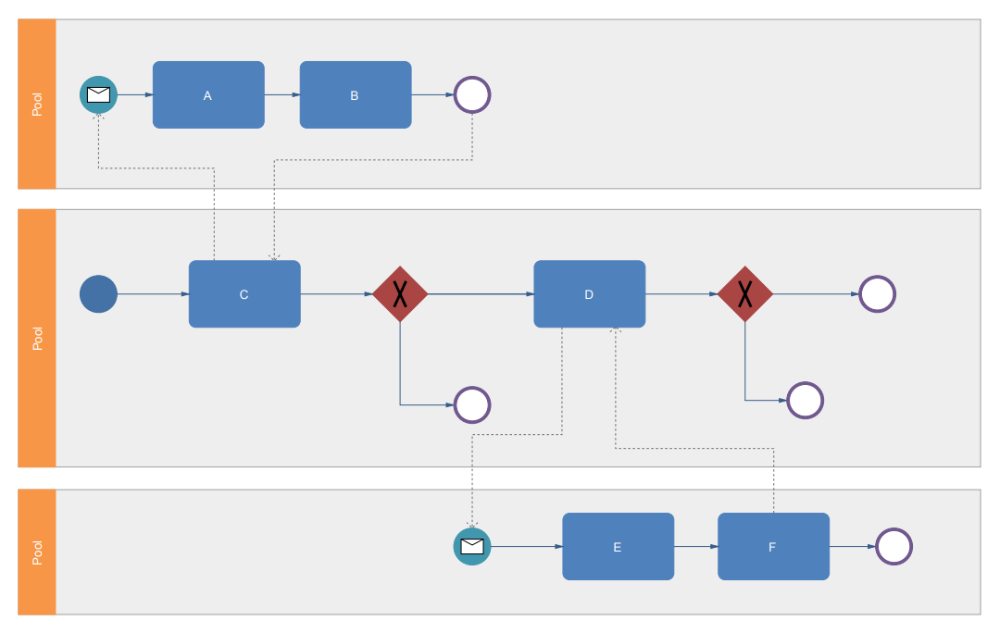

# Geschäftsprozesse <!-- omit in toc -->

|                        |                 |
| :--------------------- | --------------- |
| Projektname:           | \<Projektname\> |
| Letzte Aktualisierung: | \<TT.MM.JJJJ\>  |

## Inhaltsverzeichnis <!-- omit in toc -->

- [Geschäftsprozesse](#geschäftsprozesse)
  - [\<Titel Prozess 01\>](#titel-prozess-01)
  - [\<Titel Prozess 02\>](#titel-prozess-02)
  - [\<Titel Prozess 03\>](#titel-prozess-03)

## Geschäftsprozesse

### \<Titel Prozess 01>

\<Eine kurze Beschreibung des Prozesses>

Quelldatei der Graphik: [Link](xyz.bpmn)

### \<Titel Prozess 02>

\<Eine kurze Beschreibung des Prozesses>

Quelldatei der Graphik: [Link](xyz.bpmn)

### \<Titel Prozess 03>

...

<!-- 
Quelle des Beispielbildes: https://www.edrawsoft.com/template-simple-bpmn.html
-->